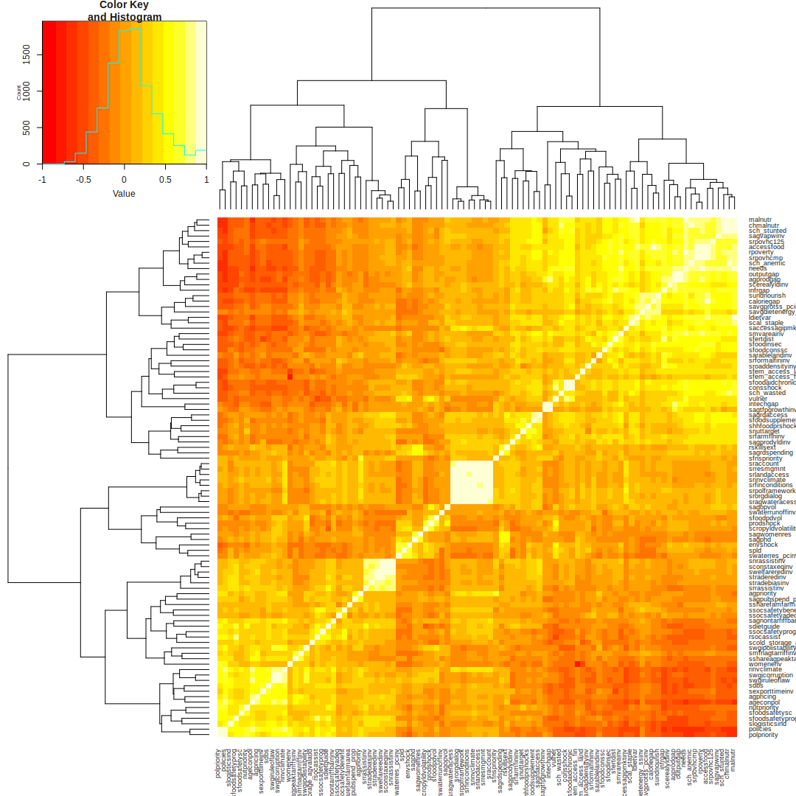
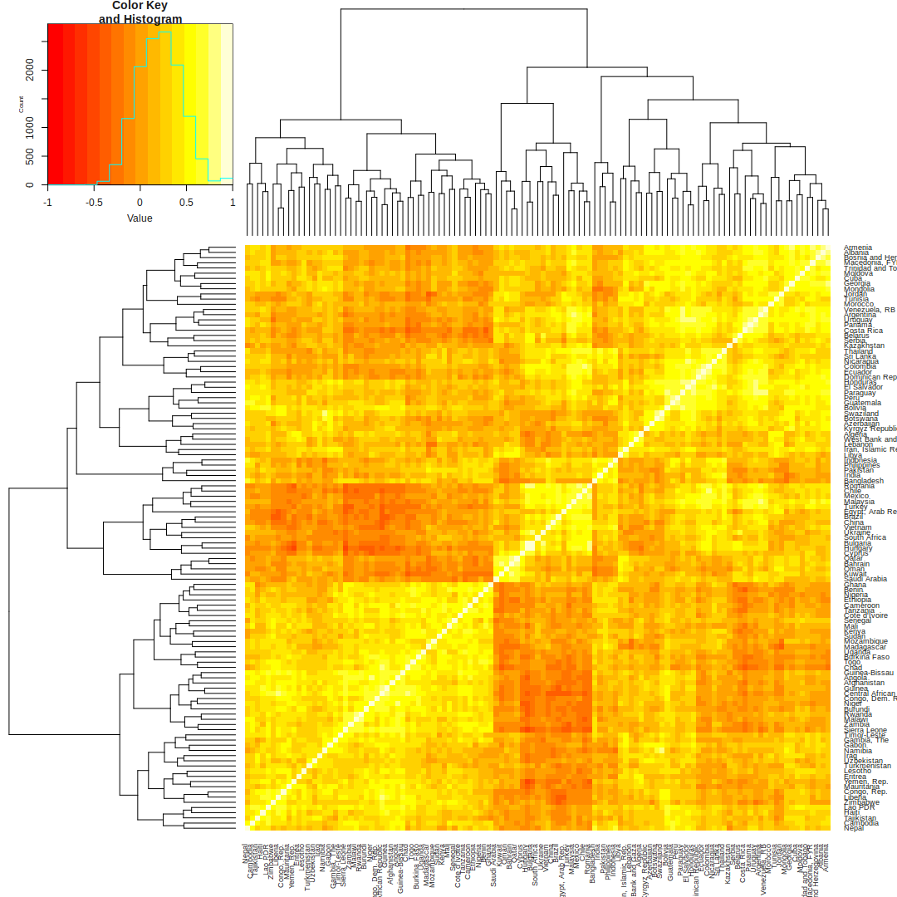

Load data
---------

Note: For interactive heatmaps, `heatmap.2` can be swapped out for `d3heatmap`.

``` r
#library('d3heatmap')
library('dplyr')
```

    ## 
    ## Attaching package: 'dplyr'
    ## 
    ## The following objects are masked from 'package:stats':
    ## 
    ##     filter, lag
    ## 
    ## The following objects are masked from 'package:base':
    ## 
    ##     intersect, setdiff, setequal, union

``` r
library('gplots')
library('reshape2')
library('ggplot2')
library('RColorBrewer')

# load data
df = tbl_df(read.delim('Recipient_Scorecard_10th_September_Rescaled.tsv',
                       strip.white=TRUE))

# remove region rows
regions = c("South Asia", "Europe & Central Asia", "Middle East & North
            Africa", "Sub-Saharan Africa", "Latin America & Caribbean", 
            "East Asia & Pacific", "Low income", "Upper middle income", 
            "Lower middle income", "High income: nonOECD", "High income: OECD",
            "Developing Country", "Fragile States")
df = df %>% filter(!Country %in% regions)

df = df %>% select(-X)
# Fix numeric columns
#non_numeric_cols = c("Country", "iso3c", "Regioncode", "Income.Group")
#numeric_cols     = colnames(df)[colnames(df) != non_numeric_cols]

#numeric_cols = colnames(df)[5:ncol(df)]

# not working..
#df %>% mutate_each_(as.numeric(gsub(',', '', .)), numeric_cols)

#for (x in numeric_cols) {
#    df[,x] = as.numeric(gsub(',', '', df[,x]))
#}

# Fix numeric cols
# http://stackoverflow.com/questions/1523126/how-to-read-a-csv-file-in-r-where-some-numbers-contain-commas
numeric_cols = 5:ncol(df)
df[,numeric_cols] = lapply(df[,numeric_cols], function(df) {
    as.numeric(gsub(",", "", df))
})

# For now, drop Countries with incomplete data...
df = df[complete.cases(df),]

# Indicator variables
needs_and_policies_cols = 10:105

x = df[,needs_and_policies_cols]
rownames(x) = df$Country

#d3heatmap(x, colors='BuPu')
heatmap.2(as.matrix(x), col=brewer.pal(9, 'BuPu'), trace='none')
```


Country and variable trends
---------------------------

### Needs and Policies variable correlations

``` r
#d3heatmap(cor(df[,needs_and_policies_cols]))
heatmap.2(cor(df[,needs_and_policies_cols]), trace='none')
```



### Country correlations

``` r
x = cor(t(df[,needs_and_policies_cols]))
rownames(x) = colnames(x) = df$Country
#d3heatmap(x)
heatmap.2(as.matrix(x), trace='none')
```



### Variable distributions

``` r
# variable category
categories = read.csv('Recipient_Scorecard_10th_September_Rescaled_Categories.csv',
                      header=FALSE)

# long version of data
df_ind = df[,needs_and_policies_cols]
df_long = melt(df_ind)
```

    ## No id variables; using all as measure variables

``` r
# add categories
df_long$category = rep(as.factor(as.character(categories)), each=nrow(df_ind))

#ggplot(df_long, aes(x=value, group=variable, color=category)) + geom_density()
ggplot(df_long, aes(x=value, group=variable)) + 
    geom_density() +
    facet_grid(category~.)
```


